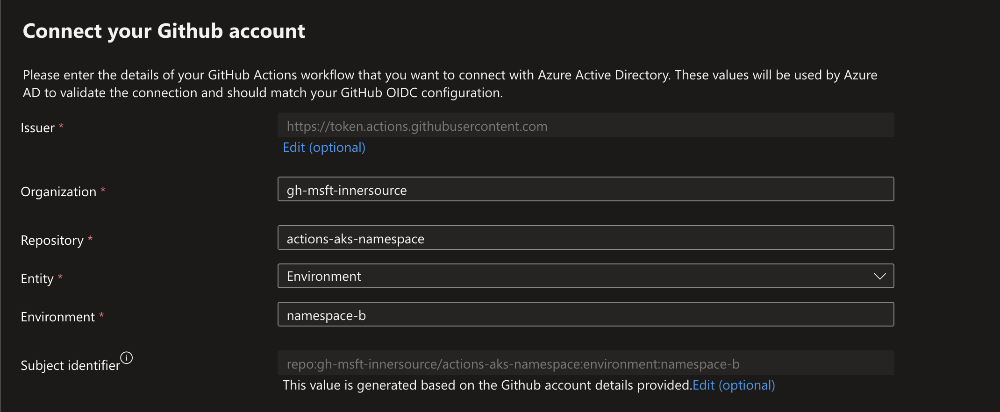

# Securely Connect GitHub Actions to an AAD RBAC-enabled AKS Cluster

This example shows how to securely connect to an AKS cluster that is utilizing Azure RBAC (see [link](https://learn.microsoft.com/azure/aks/manage-azure-rbac)).

## Prerequisites

- An Azure Subscription with contributor access
- AZ CLI installed (see [instructions](https://learn.microsoft.com//cli/azure/install-azure-cli))
- Kubectl installed (see [instructions](https://kubernetes.io/docs/tasks/tools/))

## Setup Instructions

### Azure Setup

1) Create a new AKS cluster. Ensure that the cluster is setup with `Azure AD authentication with Azure RBAC` (see [instructions](https://learn.microsoft.com/azure/aks/manage-azure-rbac#create-a-new-aks-cluster-with-managed-azure-ad-integration-and-azure-rbac-for-kubernetes-authorization))

2) Grant yourself access to the cluster by assigning the `Azure Kubernetes Service RBAC Cluster Admin` to either yourself or an AAD group you are a member of.

3) Login to the AKS cluster by using:

    ```shell
    az aks get-credentials -g <resource-group-name> -n <cluster-name>
    ```

4) Create two separate namespaces in the AKS cluster:

    ```shell
    kubectl create namespace namespace-a
    kubectl create namespace namespace-b
    ```

5) Start a sample pod in one of the namespaces:

    ```shell
    kubectl run nginx --image=nginx --restart=Never --namespace=namespace-a
    ```

6) Create two different managed identities in Azure (see [instructions](https://learn.microsoft.com/azure/active-directory/managed-identities-azure-resources/how-manage-user-assigned-managed-identities?pivots=identity-mi-methods-azp))

7) Obtain the IDs of the AKS cluster and the 2 managed identities for use later:

    ```shell
    AKS_ID=$(az aks show -g <resource-group-name> -n <cluster-name> --query id -o tsv)

    NSA_ID=$(az identity show  -g <resource-group-name> -n <msi-name> --query clientId -o tsv)
    NSB_ID=$(az identity show  -g <resource-group-name> -n <msi-name-2> --query clientId -o tsv)
    ```

8) Allow each managed identity the ability to login to the AKS cluster:

    ```shell
    az role assignment create --role "Azure Kubernetes Service Cluster User Role" --assignee $NSA_ID --scope $AKS_ID
    az role assignment create --role "Azure Kubernetes Service Cluster User Role" --assignee $NSB_ID --scope $AKS_ID
    ```

9) Assign write permissions for each managed identity to the related AKS namespace:

    ```shell
    az role assignment create --role "Azure Kubernetes Service RBAC Writer" --assignee $NSA_ID --scope $AKS_ID/namespaces/namespace-a
    az role assignment create --role "Azure Kubernetes Service RBAC Writer" --assignee $NSB_ID --scope $AKS_ID/namespaces/namespace-b
    ```

10) Create a new federated credential for each managed identity (see [instructions](https://learn.microsoft.com/azure/active-directory/workload-identities/workload-identity-federation-create-trust-user-assigned-managed-identity?pivots=identity-wif-mi-methods-azp#github-actions-deploying-azure-resources)). Specify the appropriate GitHub organization and repository. Set the entity type to `Environment`. See example settings:



### GitHub Setup

1) Create a GitHub Environment for each namespace (see [instructions](https://docs.github.com/en/actions/deployment/targeting-different-environments/using-environments-for-deployment#creating-an-environment)). Setup any additional controls that are required (such as required approvers, specific branches, etc...)

2) Create a new environment secret named `AZURE_CLIENT_ID` with the appropriate client ID of the relevant managed identity (see [instructions](https://docs.github.com/en/actions/security-guides/encrypted-secrets#creating-encrypted-secrets-for-an-environment)). Repeat this step on the other environment.

3) Create a new variable named `AZURE_TENANT_ID` at the repository level (see [instructions](https://docs.github.com/en/actions/learn-github-actions/variables#creating-configuration-variables-for-a-repository)).

4) Create a new variable named `AZURE_SUBSCRIPTION_ID` at the repository level (see [instructions](https://docs.github.com/en/actions/learn-github-actions/variables#creating-configuration-variables-for-a-repository)).

5) Run the [workflow](.github/workflows/aad-rbac.yml)
